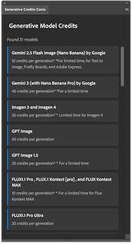

# ps-generative-credits-plugin

A UXP plugin for Adobe Photoshop that displays Adobe Firefly partner model information and their generative credit costs.

## Features

- Fetches real-time model data from Adobe's official documentation
- Displays model names and credit costs in an easy-to-read format

## Installation

### Enable Developer Mode in Photoshop
1. Launch Photoshop (2025/26.0 or greater)
2. Go to **Settings > Plugins** and check **"Enable Developer Mode"**
3. Restart Photoshop

### Install Plugin via UXP Developer Tool
1. **Download or clone this plugin** to a folder on your computer (e.g., `/Users/YourName/ps-generative-credits-plugin/`)
2. Launch **UXP Developer Tools** from Creative Cloud
3. Enable developer mode when prompted
4. Select **File > Add Plugin**
5. Navigate to the the directory you downloaded the files and select **manifest.json**:
6. Click **Load**
7. In Photoshop open the plugin panel : Photoshop > Plugins > Generative Credits Cost

## Requirements

- Adobe Photoshop 24.0.0 or later
- Internet connection (to fetch model data)

## Data Source

This plugin fetches data from:
https://helpx.adobe.com/firefly/web/get-started/learn-the-basics/non-adobe-models-in-adobe-products.html

The plugin parses HTML tables to extract model names and credit costs. If Adobe changes the page structure, the plugin may need to be updated.

**Note**: This plugin is not officially affiliated with Adobe Inc. It simply provides a convenient interface to view publicly available model information from Adobe's documentation.

## License

Project released under a [MIT License](LICENSE.md).

